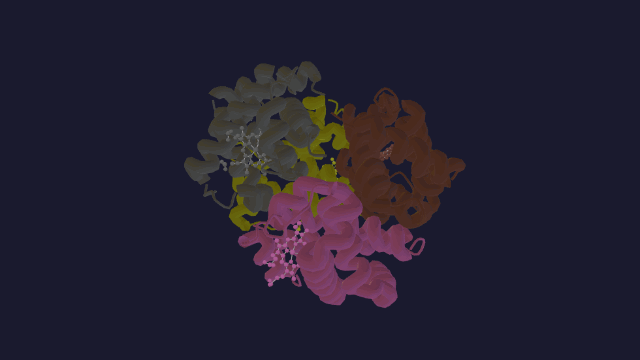

# MolViewer

**Free, open-source 3D molecule viewer that runs in the browser: [molviewer.bio](https://molviewer.bio)**

View proteins, DNA and RNA from the PDB, AlphaFold predictions and PubChem small molecules, or open your own PDB, mmCIF, SDF, MOL or XYZ file. Nothing to install.



Try it: [hemoglobin 4HHB](https://molviewer.bio/pdb/4HHB) · [p53 AlphaFold model](https://molviewer.bio/af/P04637) · [caffeine](https://molviewer.bio/compound/caffeine) · [structure collections](https://molviewer.bio/collections)

<!-- After the first Zenodo release, add its DOI badge here, e.g.
[](https://doi.org/10.5281/zenodo.XXXXXXX) -->

## Features

### Visualization
- **Representations** - Ball & Stick, Stick, Spacefill, Cartoon, VDW Surface, SAS Surface
- **Color Schemes** - CPK, Chain, Residue Type, B-factor, Rainbow, Secondary Structure
- **Aromatic Rings** - Automatic detection and visualization

### Multi-Structure Support
- Load up to 10 structures simultaneously
- **Overlay** or **Side-by-Side** layout modes
- Per-structure visibility toggle and deletion
- Independent representation/color settings per structure

### Sequence Viewer
- Linear sequence with one-letter amino acid codes
- Secondary structure color bars (helix/sheet/coil)
- Bidirectional sync with 3D view (click residue ↔ highlight atom)
- Multi-chain support with chain selector tabs

### Measurements & Labels
- Distance, angle, and dihedral measurements
- Persistent 3D atom labels
- **Right-click context menu:**
  - Focus on atom
  - Measure From Here
  - Add Label
  - Select Residue
  - Select Chain

### User Experience
- **Undo/Redo** - Full history with 50-state limit (Ctrl+Z / Ctrl+Y)
- **Panel Persistence** - Collapsible panel states saved to localStorage
- **Themes** - Dark and light mode
- **Keyboard Shortcuts** - Quick access to common operations
- **Export** - High-resolution screenshots (1x, 2x, 4x) with customizable backgrounds
- **Auto-Rotate** - Toggle rotation for presentations
- **Camera Presets** - Quick view orientations

### File Support
- Drag & drop or browse for files
- **Formats:** PDB, CIF (mmCIF), SDF, MOL, XYZ
- **PDB ID Lookup** - Fetch directly from RCSB PDB (uses mmCIF format)
- **AlphaFold DB** - Fetch predicted structures by UniProt ID
- **PubChem** - Fetch small molecules by name or CID (3D conformer, with a 2D fallback)
- **Sample Molecules** - Built-in caffeine, aspirin, and water

### Sharing and Export
- **Readable URLs** - The address bar follows what's loaded: `/pdb/4HHB`, `/af/P04637`, `/compound/caffeine`, with `?repr=` and `?color=`
- **Share links** - `/s/:id` restores the whole scene (structures, camera, measurements, labels)
- **Embedding** - `<iframe src="https://molviewer.bio/embed/pdb/4HHB">`, with `?spin=1`, `?bg=light` and `?ui=minimal`; oEmbed for WordPress, Notion and Medium
- **Export** - PNG (1x/2x/4x), turntable video (WebM/MP4) and 3D models (GLB, STL)

## Requirements

- Node.js >= 20
- pnpm (package manager)

## Quick Start

```bash
pnpm install
pnpm dev
```

Opens at http://localhost:3000

## Scripts

```bash
pnpm dev           # Start development server
pnpm build         # Build for production
pnpm preview       # Preview production build
pnpm typecheck     # Run TypeScript checks
pnpm lint          # Run ESLint
pnpm lint:fix      # Auto-fix linting issues
pnpm format        # Format code with Prettier
pnpm format:check  # Check formatting
pnpm test          # Run unit tests (watch mode)
pnpm test:run      # Run unit tests once
pnpm test:coverage # Run tests with coverage
pnpm test:e2e      # Run Playwright e2e tests
pnpm pages:dev     # Run Cloudflare Pages Functions locally (proxies vite at :3000)
pnpm pages:preview # Serve the production build (dist/) with Functions
pnpm validate:data # Check data/*.json against RCSB, AlphaFold DB and PubChem
```

## Site architecture

The React app is a single page, but everything crawlers and social networks see is plain HTML:

- **Landing pages** (`/pdb/:id`, `/af/:id`, `/s/:id`, `/embed/*`, `/compound/cid/:cid`) are Cloudflare Pages Functions in [`functions/`](functions/). They fetch entry details ([`site/upstream/`](site/upstream/)) and render visible text below the viewer plus metadata ([`site/render/`](site/render/)) into the SPA shell. Unknown IDs return a real 404.
- **Static pages** (tool pages, `/learn/*`, `/about`, `/compare`, `/collections/*`, `/compounds`, `/compound/:slug`), the sitemaps and the social cards are generated at build time by [`site/build/`](site/build/) from [`site/content/`](site/content/) and the curated datasets in [`data/`](data/).
- [`functions/_middleware.ts`](functions/_middleware.ts) turns unknown paths into 404s and sets the Content-Security-Policy header.
- Product events (`POST /api/event`) go to Workers Analytics Engine; see [`scripts/query-events.ts`](scripts/query-events.ts).

Curated data is refreshed with `pnpm exec tsx scripts/validate-ids.ts` and `pnpm exec tsx scripts/validate-compounds.ts`. Screenshots and the hero GIF are captured from the running app with `scripts/capture-screenshots.ts` and `scripts/capture-hero-gif.ts`.

### One-time setup before deploy

1. **Create the KV namespace** for shareable session storage:
   ```bash
   pnpm wrangler kv namespace create SHARE_KV
   pnpm wrangler kv namespace create SHARE_KV --preview
   ```
2. **Paste the returned IDs** into [`wrangler.toml`](wrangler.toml), replacing
   `REPLACE_WITH_PRODUCTION_KV_ID` and `REPLACE_WITH_PREVIEW_KV_ID`.
3. **Submit `/sitemap.xml`** (a sitemap index) to Google Search Console after the first deploy.

### Local development with Pages Functions

`pnpm dev` runs Vite on `:3000` for the SPA only. To exercise the Pages Functions
(share links, landing pages, 404s), run both:

```bash
pnpm dev           # terminal 1: Vite SPA on :3000
pnpm pages:dev     # terminal 2: Wrangler proxies :3000 and serves functions/
```

Static pages and sitemaps only exist after a build: `pnpm build && pnpm pages:preview`.

## Project Structure

```
src/
├── components/
│   ├── ui/              # FileUpload, ControlPanel, Toolbar, SequenceViewer, ContextMenu, etc.
│   ├── viewer/          # MoleculeViewer, MeasurementOverlay, Labels3D
│   ├── representations/ # BallAndStick, Stick, Spacefill, Cartoon, Surface, AromaticRings
│   └── layout/          # Header, Sidebar, ViewerContainer
├── colors/              # Color scheme definitions
├── parsers/             # PDB, mmCIF, SDF, XYZ file parsers
├── constants/           # Element data (colors, radii for 30+ elements)
├── config/              # Rendering, export, UI, camera presets configuration
├── context/             # Theme context (dark/light mode)
├── hooks/               # Custom React hooks
├── utils/               # Bond inference, surface generation, measurements, export
├── store/               # Zustand state management with undo/redo
├── types/               # TypeScript interfaces
├── workers/             # Web workers for background tasks
└── styles/              # Global CSS
```

## Supported File Formats

| Format | Extension | Description |
|--------|-----------|-------------|
| PDB | `.pdb` | Protein Data Bank format (with residue/chain support) |
| CIF | `.cif`, `.mmcif`, `.cif.gz` | PDBx/mmCIF format (preferred by RCSB, with secondary structure) |
| SDF | `.sdf`, `.mol` | Structure Data File |
| XYZ | `.xyz` | Cartesian coordinates |

## Representations

| Type | Description |
|------|-------------|
| Ball & Stick | Atoms as spheres connected by bond cylinders |
| Stick | Bonds only with larger radius for clarity |
| Spacefill | Van der Waals spheres showing molecular envelope |
| Cartoon | Protein secondary structure ribbons (helix, sheet, coil) |
| Surface (VDW) | Van der Waals molecular surface |
| Surface (SAS) | Solvent Accessible Surface (1.4Å probe radius) |

## Color Schemes

| Scheme | Description |
|--------|-------------|
| CPK | Element colors (carbon gray, oxygen red, nitrogen blue, etc.) |
| Chain | Distinct color per chain ID |
| Residue Type | Amino acid classification (hydrophobic, polar, charged, etc.) |
| B-factor | Temperature factor gradient (blue → red) |
| Rainbow | N→C terminus gradient |
| Secondary Structure | Helix (pink), Sheet (yellow), Coil (gray) |

## Keyboard Shortcuts

| Key | Action |
|-----|--------|
| `1` | Ball & Stick representation |
| `2` | Stick representation |
| `3` | Spacefill representation |
| `D` | Distance measurement mode |
| `A` | Angle measurement mode |
| `H` | Home view / Reset camera |
| `R` | Toggle auto-rotate |
| `Ctrl+Z` | Undo |
| `Ctrl+Y` / `Ctrl+Shift+Z` | Redo |
| `Ctrl+S` | Export screenshot |
| `Backspace` | Undo atom selection |
| `?` | Show shortcuts help |
| `Esc` | Cancel current operation |

## Tech Stack

- React 19
- Three.js / React Three Fiber / Drei
- Zustand + zundo (state management with undo/redo)
- Vite (build tool)
- TypeScript
- Vitest (unit testing)
- Playwright (e2e testing)

## Citing

If you use MolViewer in teaching or research, please cite it using [CITATION.cff](CITATION.cff) (GitHub shows a "Cite this repository" button).

## Repository topics

`molecular-visualization` `protein-structure` `pdb` `mmcif` `alphafold` `structural-biology` `bioinformatics` `chemistry` `webgl` `threejs` `react-three-fiber` `molecule-viewer`

## License

[MIT](LICENSE)
